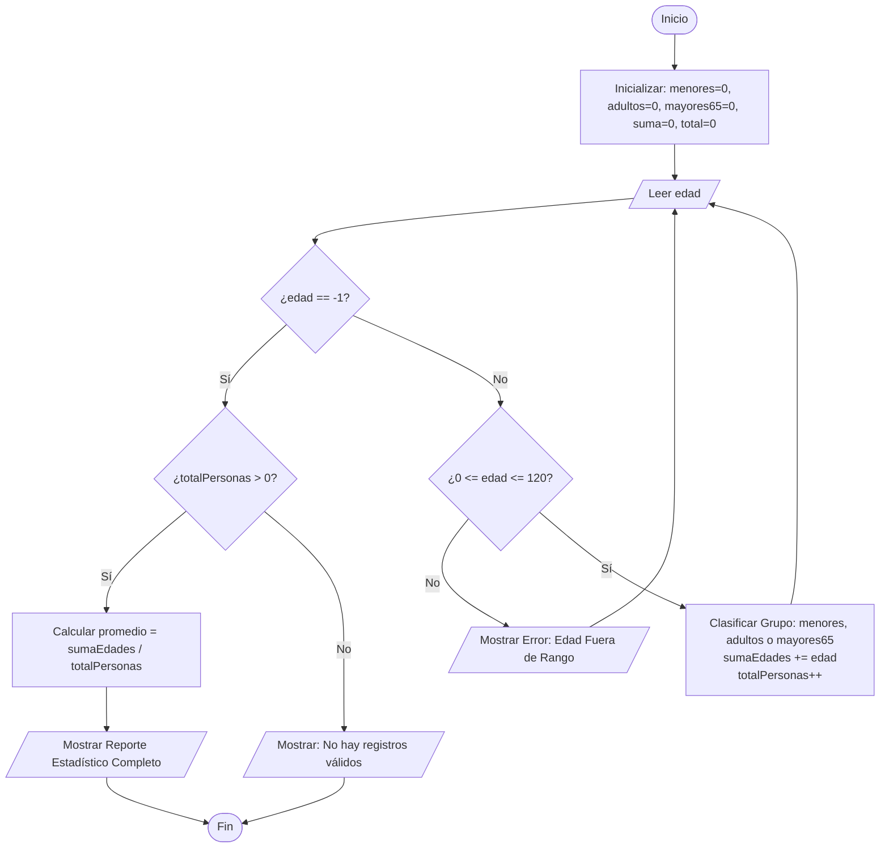

# Ejercicio 02: Control de Edades con Centinela

## 1. Análisis del Problema
El objetivo principal de este programa es registrar edades de un grupo indeterminado de personas utilizando una **estructura de repetición controlada por un valor centinela (`-1`)**.

### Requerimientos Funcionales:
1. **Control de Flujo con Centinela:** El ingreso de datos se repite indefinidamente hasta que el usuario ingresa la edad `-1`, la cual detiene la lectura.
2. **Validación de Datos:** Solo se deben procesar edades biológicamente válidas (rango de `0` a `120` años). Si se ingresa una edad fuera de rango o un caracter no numérico, el programa muestra un mensaje de error y solicita nuevamente el dato sin interrumpir la ejecución.
3. **Clasificación por Rango Etario:**
   - **Menores de edad:** `< 18` años.
   - **Adultos:** `18` a `64` años.
   - **Adultos Mayores / Tercera Edad:** `>= 65` años.
4. **Cálculo de Indicadores:**
   - Contadores independientes por cada grupo de edad.
   - Conteo total de personas válidas procesadas.
   - Suma acumulada de edades para calcular el **promedio general de edad**.

---

## 2. Entradas, Procesos y Salidas

| Fase | Elemento / Variable | Tipo de Dato | Descripción |
| :--- | :--- | :--- | :--- |
| **Entrada** | `edad` | Entero (`int`) | Edad ingresada por consola (`-1` para finalizar). |
| **Proceso** | `validaRango` | Booleano | Condición `edad >= 0 Y edad <= 120`. |
| | `menores` | Entero (`int`) | Contador de personas `< 18` años. |
| | `adultos` | Entero (`int`) | Contador de personas entre `18` y `64` años. |
| | `mayores65` | Entero (`int`) | Contador de personas `>= 65` años. |
| | `sumaEdades` | Entero (`int`) | Acumulador de las edades válidas registradas. |
| | `totalPersonas` | Entero (`int`) | Contador general de registros válidos. |
| | `promedio` | Real (`double`) | `sumaEdades / totalPersonas` (evaluado si `totalPersonas > 0`). |
| **Salida** | Reporte Consolidado | Texto / Métricas | Cantidad por categoría, total de personas y promedio general. |

---

## 3. Algoritmo en Pseudocódigo (PSeInt / Estándar)

```text
Algoritmo ControlEdadesCentinela
    Definir edad, menores, adultos, mayores65, sumaEdades, totalPersonas Como Entero
    Definir promedio Como Real
    
    menores <- 0
    adultos <- 0
    mayores65 <- 0
    sumaEdades <- 0
    totalPersonas <- 0
    
    Escribir "=== SISTEMA DE CONTROL DE EDADES ==="
    Escribir "Ingrese la edad (-1 para finalizar):"
    Leer edad
    
    Mientras edad <> -1 Hacer
        Si edad >= 0 Y edad <= 120 Entonces
            // Clasificación de la persona
            Si edad < 18 Entonces
                menores <- menores + 1
            Sino
                Si edad <= 64 Entonces
                    adultos <- adultos + 1
                Sino
                    mayores65 <- mayores65 + 1
                FinSi
            FinSi
            
            // Acumulación y conteo
            sumaEdades <- sumaEdades + edad
            totalPersonas <- totalPersonas + 1
        Sino
            Escribir "[!] Error: Edad fuera de rango válido (0 a 120 años)."
        FinSi
        
        Escribir "Ingrese la edad (-1 para finalizar):"
        Leer edad
    FinMientras
    
    // Presentación de resultados
    Escribir "========================================"
    Escribir "          RESUMEN ESTADÍSTICO           "
    Escribir "========================================"
    
    Si totalPersonas > 0 Entonces
        promedio <- sumaEdades / totalPersonas
        Escribir "Total de personas registradas : ", totalPersonas
        Escribir "Menores de edad (<18 años)    : ", menores
        Escribir "Adultos (18 a 64 años)        : ", adultos
        Escribir "Adultos mayores (>= 65 años)  : ", mayores65
        Escribir "Promedio general de edad      : ", promedio, " años"
    Sino
        Escribir "No se registraron edades válidas para procesar."
    FinSi
    
    Escribir "========================================"
FinAlgoritmo
```

---

## 4. Diagrama de Flujo (Representación Mermaid)



---

## 5. Prueba de Escritorio

### Tabla de Traza

| Paso | Entrada (`edad`) | `edad == -1` | Valida `[0-120]` | `menores` | `adultos` | `mayores65` | `sumaEdades` | `totalPersonas` | Acción / Salida en Consola |
| :---: | :---: | :---: | :---: | :---: | :---: | :---: | :---: | :---: | :--- |
| **1** | - | - | - | 0 | 0 | 0 | 0 | 0 | Inicialización de variables. |
| **2** | `15` | No | Sí | **1** | 0 | 0 | **15** | **1** | Clasifica como Menor de edad. |
| **3** | `30` | No | Sí | 1 | **1** | 0 | **45** | **2** | Clasifica como Adulto. |
| **4** | `70` | No | Sí | 1 | 1 | **1** | **115** | **3** | Clasifica como Adulto Mayor. |
| **5** | `140` | No | No | 1 | 1 | 1 | 115 | 3 | Muestra: `[!] Error: Edad no válida.` |
| **6** | `-1` | **Sí** | - | 1 | 1 | 1 | 115 | 3 | Se activa el **centinela**, rompe el ciclo. |
| **7** | - | - | - | 1 | 1 | 1 | 115 | 3 | **Promedio:** `115 / 3 = 38.33` años. |

---

## 6. Código Fuente Implementado (Java)

```java
package ejercicio02;

import java.util.Scanner;

public class Ejercicio02 {

    public static void main(String[] args) {
        Scanner scanner = new Scanner(System.in);

        int menores = 0;
        int adultos = 0;
        int mayores65 = 0;
        int sumaEdades = 0;
        int totalPersonas = 0;
        int edad = 0;

        System.out.println("==================================================");
        System.out.println("       SISTEMA DE CONTROL DE EDADES             ");
        System.out.println("==================================================");
        System.out.println("Instrucciones: Ingrese las edades una a una.");
        System.out.println("Para finalizar el ingreso, escriba el centinela: -1\n");

        while (true) {
            System.out.print("Ingrese la edad (-1 para terminar): ");

            if (scanner.hasNextInt()) {
                edad = scanner.nextInt();

                if (edad == -1) {
                    break;
                }

                if (edad < 0 || edad > 120) {
                    System.out.println("  [!] Error: Edad no válida. Debe estar entre 0 y 120 años.");
                    continue;
                }

                if (edad < 18) {
                    menores++;
                } else if (edad <= 64) {
                    adultos++;
                } else {
                    mayores65++;
                }

                sumaEdades += edad;
                totalPersonas++;

            } else {
                System.out.println("  [!] Error: Entrada inválida. Ingrese únicamente números enteros.");
                scanner.next();
            }
        }

        System.out.println("\n==================================================");
        System.out.println("              RESUMEN ESTADÍSTICO                 ");
        System.out.println("==================================================");

        if (totalPersonas > 0) {
            double promedio = (double) sumaEdades / totalPersonas;

            System.out.println(" Total de personas registradas : " + totalPersonas);
            System.out.println(" Menores de edad (< 18 años)    : " + menores);
            System.out.println(" Adultos (18 a 64 años)         : " + adultos);
            System.out.println(" Mayores de 65 años (>= 65)     : " + mayores65);
            System.out.printf(" Promedio general de edades     : %.2f años\n", promedio);
        } else {
            System.out.println(" No se registraron edades válidas para procesar.");
        }

        System.out.println("==================================================");

        scanner.close();
    }
}
```

---

## 7. Evidencia de Ejecución en Consola

```text
==================================================
       SISTEMA DE CONTROL DE EDADES             
==================================================
Instrucciones: Ingrese las edades una a una.
Para finalizar el ingreso, escriba el centinela: -1

Ingrese la edad (-1 para terminar): 15
Ingrese la edad (-1 para terminar): 30
Ingrese la edad (-1 para terminar): 70
Ingrese la edad (-1 para terminar): 140
  [!] Error: Edad no válida. Debe estar entre 0 y 120 años.
Ingrese la edad (-1 para terminar): -1

==================================================
              RESUMEN ESTADÍSTICO                 
==================================================
 Total de personas registradas : 3
 Menores de edad (< 18 años)    : 1
 Adultos (18 a 64 años)         : 1
 Mayores de 65 años (>= 65)     : 1
 Promedio general de edades     : 38.33 años
==================================================
```